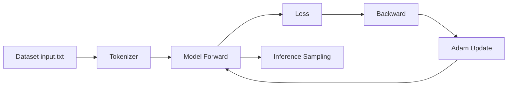
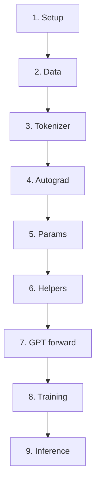
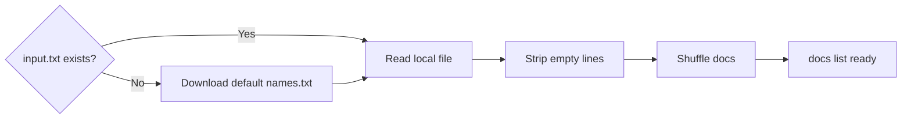
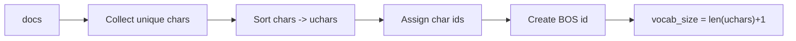
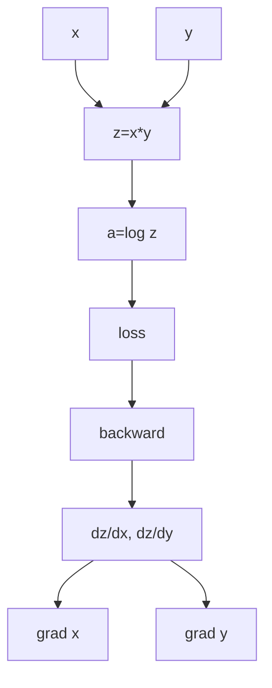
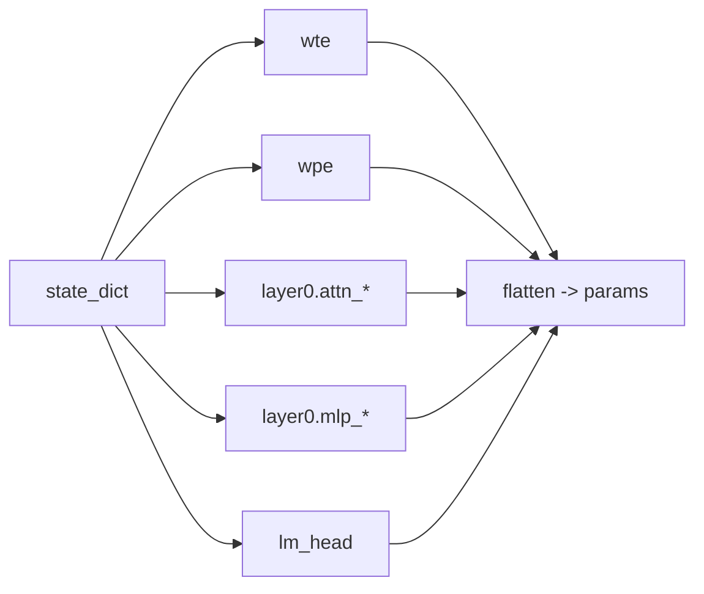
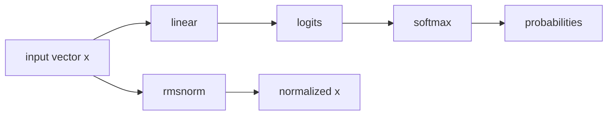
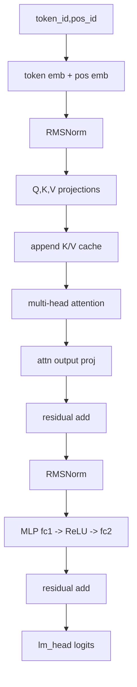
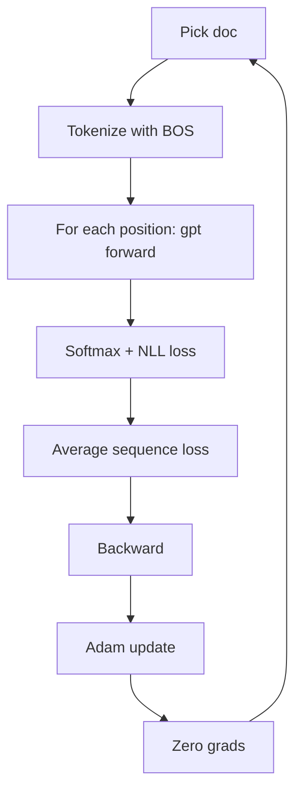
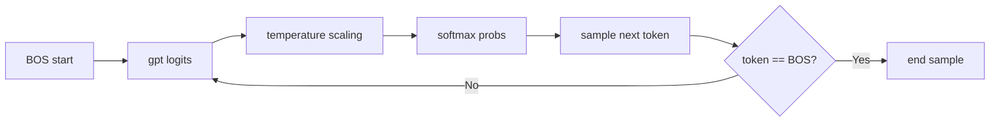

# microgpt: Comprehensive Simple Guide

This guide explains `microgpt.py` and `microgpt_commented.py` in a practical, easy-to-follow way.

## 1. What microgpt is

`microgpt` is a tiny GPT-style language model written in pure Python standard library.
It is intentionally minimal so you can see exactly how training and generation work.

What it includes:

- dataset loading
- character tokenization
- custom autograd (`Value` class)
- transformer forward pass
- Adam optimizer
- autoregressive sampling

## 2. Script structure map

The code is easiest to understand in blocks:

1. Imports and random seed
2. Dataset loading
3. Tokenizer setup
4. `Value` autograd engine
5. Parameter initialization
6. Model helper functions (`linear`, `softmax`, `rmsnorm`)
7. GPT forward function (`gpt`)
8. Training loop
9. Inference loop

## 3. Dataset block (what those comments mean)

In code comments, this section says: create `docs`, a list of text samples.

What actually happens:

- if `input.txt` is missing, script downloads names dataset
- reads all non-empty lines
- shuffles order for training

Why it matters:

- this model learns patterns from line-by-line examples
- input quality directly controls output quality

## 4. Tokenizer block

Comments in this section describe converting characters to token ids.

Key ideas:

- it is **character-level**, not word-level
- all unique characters become ids `0..N-1`
- `BOS` is an extra special token id used as boundary marker

Example:

- text: `anna`
- tokens: `[BOS, a, n, n, a, BOS]`

## 5. `Value` class (autograd) block

This is the most important conceptual part.

Every scalar in computation is a `Value` object containing:

- `data`: numeric result
- `grad`: gradient accumulator
- `_children`: inputs that produced this value
- `_local_grads`: local derivatives for chain rule

When you compute math expressions, you build a graph.
When you call `loss.backward()`, the graph is traversed in reverse order and gradients are accumulated.

## 6. Parameter initialization block

Comments here describe creating model weights and storing them in `state_dict`.

Major parameter groups:

- `wte`: token embeddings
- `wpe`: positional embeddings
- attention weights: `attn_wq`, `attn_wk`, `attn_wv`, `attn_wo`
- MLP weights: `mlp_fc1`, `mlp_fc2`
- `lm_head`: output projection to vocab logits

Then all scalar parameters are flattened into `params` for optimizer updates.

## 7. Helper functions block

The comments in this part map to three math helpers:

- `linear(x, w)`: matrix-vector multiply
- `softmax(logits)`: normalized probabilities (with max-subtraction for stability)
- `rmsnorm(x)`: normalization based on root-mean-square

## 8. `gpt()` forward pass block

This section is the core Transformer computation.

Per token position:

1. lookup token embedding + position embedding
2. run layer(s):
   - attention sub-block
   - MLP sub-block
3. project to vocab logits with `lm_head`

Attention details:

- computes `q`, `k`, `v`
- appends current `k`,`v` to caches
- each head attends over cached time positions
- concatenates heads and projects back

## 9. Training loop block

Comments here describe standard next-token training.

For each step:

- choose one document
- tokenize with BOS boundaries
- forward through sequence (teacher forcing)
- compute average cross-entropy loss
- call `loss.backward()`
- apply Adam update to every parameter
- zero gradients

## 10. Inference loop block

Comments here describe autoregressive generation.

For each sample:

- start at `BOS`
- repeatedly call `gpt` for next-token logits
- divide logits by `temperature`
- softmax + random sampling
- stop on `BOS` or when max length reached

## 11. Comment expansion quick reference

This maps common comment phrases in `microgpt_commented.py` to concrete meaning:

- "token embedding": vector lookup by token id
- "position embedding": vector lookup by sequence index
- "residual": add block input back to output for stability
- "KV cache": stored keys/values from earlier positions for causal attention
- "teacher forcing": use true previous token as next-step input during training
- "cross-entropy": negative log probability of true next token
- "temperature": controls randomness of sampled output

## 12. Practical settings for learning

Start here for faster feedback:

- `num_steps = 200`
- `n_embd = 16`
- `block_size = 16`
- `temperature = 0.5`

Then scale gradually:

- more data quality first
- more steps second
- larger model last

## 13. Reading order recommendation

Use this order:

1. `microgpt.py` (see full flow quickly)
2. `microgpt_commented.py` (line-by-line intent)
3. this guide for concepts + diagrams

## 14. File locations

- `microgpt.py`: original script
- `microgpt_commented.py`: heavily commented version
- `docs/MICROGPT_GUIDE.md`: comprehensive guide with diagrams
- `README.md`: quick start and project overview
