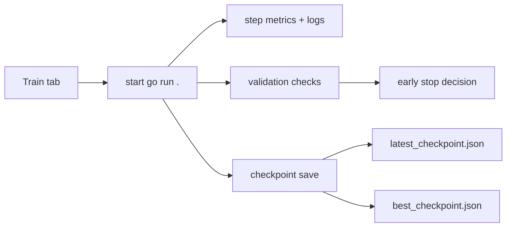

# MircoGPT-tui Guide

## Purpose

One TUI for:
- training configuration
- monitoring
- runs/models inspection
- chat testing

## Tabs

- `Splash`: animated intro
- `Train`: full variable editor and guidance
- `Monitor`: status, realtime graphs, eval tracking, and metric explorer
- `Logs`: live training logs with scroll support
- `Runs`: grouped run artifacts (`train`, `system`, `eval`, `manifest`)
- `Models`: checkpoint list
- `Chat`: conversation + model selector + prompt composer

## Chat UX (Current)

- Conversation panel uses available tab height and wraps long lines.
- Scrolling supported with `pgup`/`pgdown` and `home`/`end`.
- Typing mode locks hotkeys to prevent accidental tab switching.

## Dataset Selection UX

- In `Train`, highlight `DATASET_PATH` and press `f`.
- A searchable dataset picker opens across known `.jsonl` paths.
- Type to filter, use `j/k`, press `enter` to apply path.

## Runtime Coverage

- Dataset/tokenization:
  - `DATASET_PATH`, `TOKENIZER`, `BPE_ENCODING`, `TOKEN_VOCAB_SIZE`
- Model shape:
  - `N_LAYER`, `N_EMBD`, `N_HEAD`, `BLOCK_SIZE`
- Optimizer:
  - `LEARNING_RATE`, `BETA1`, `BETA2`, `EPS_ADAM`
- Validation/early stop:
  - `VAL_SPLIT`, `EVAL_INTERVAL`, `EVAL_STEPS`, `EARLY_STOP_PATIENCE`, `EARLY_STOP_MIN_DELTA`
- Generation:
  - `TEMPERATURE`, `SAMPLE_COUNT`, `SAMPLE_MAX_NEW_TOKENS`, `TOP_K`, `TOP_P`, `REPETITION_PENALTY`, `MIN_NEW_TOKENS`, `REPEAT_LAST_N`
- Runtime/logging:
  - `TRAIN_DEVICE`, `METRIC_INTERVAL`, `LOG_LEVEL`, `VERBOSE`
- Output:
  - `MODEL_OUT_PATH`

Default device request is `TRAIN_DEVICE=cpu`.

## Training Flow

## Artifact Paths

- Logs:
  - `go/logs/train/tui_train_<run-tag>.log`
  - `go/logs/system/tui_system_metrics_<run-tag>.csv`
  - `go/logs/eval/tui_eval_metrics_<run-tag>.csv`
  - `go/logs/runs/run_<run-tag>.txt`
  - `go/logs/train_latest.log`
- Models:
  - `go/models/ckpt_<run-tag>_step<steps>_valloss<loss>.json`
  - `go/models/latest_checkpoint.json`
  - `go/models/best_checkpoint.json`

## Monitor Graphs

- Train loss (full in-run history)
- Validation loss (full in-run history)
- Generalization gap (`val_loss - train_loss`)
- Steps/sec
- Tokens/sec
- Learning rate
- Validation perplexity
- CPU %
- RAM used (MB)
- Process RSS (MB)

## Monitor Explorer

In `Monitor`, use:
- `left/right` to switch metric categories
- `up/down` to select a metric
- `enter` to focus selected metric in full graph mode
- `esc` to exit focus mode
- `pgup/pgdown/home/end` to scroll

The `Metric Explorer` panel explains each selected graph:
- what it measures
- why it matters
- how to interpret trends
